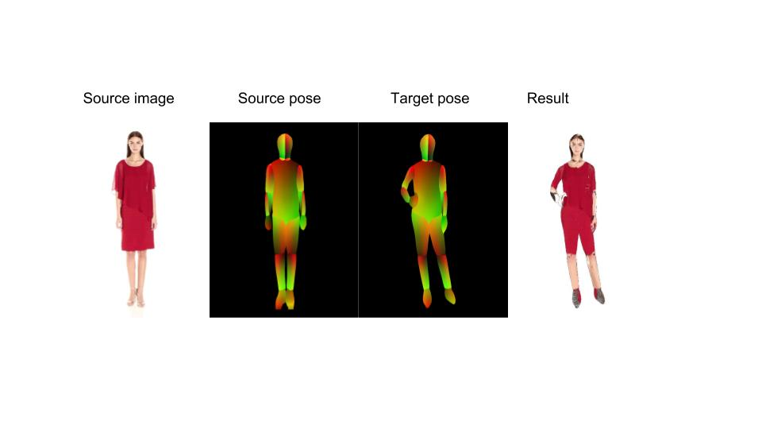

# Texture_warp
c++ code for copying texture from one human image to another human
### To compile the code:
```bash
g++ texture_transfer.cpp -o output `pkg-config --cflags --libs opencv` -fpermissive -std=c++0x
```

### To run the code (direcory with the image folders: source, source_dp, target_dp and the size the dimentions of the output image):
```bash
./output "../video_frames/" 512 669
```
- Results
<p align='center'>  
  
</p>
